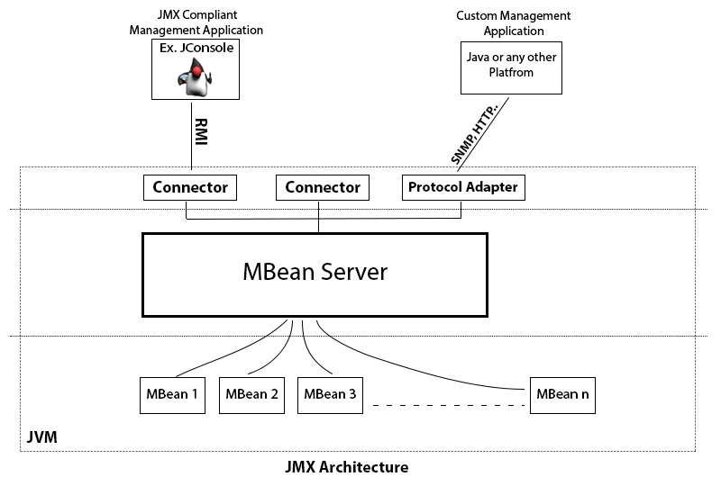
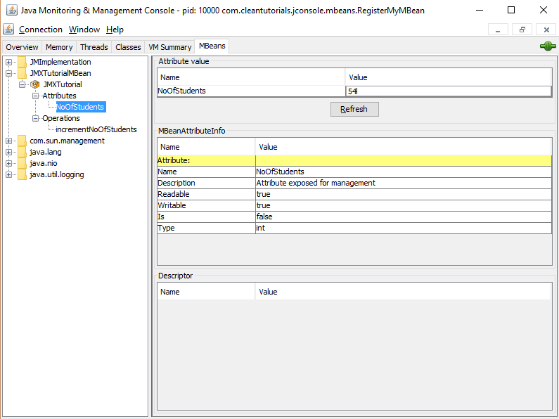
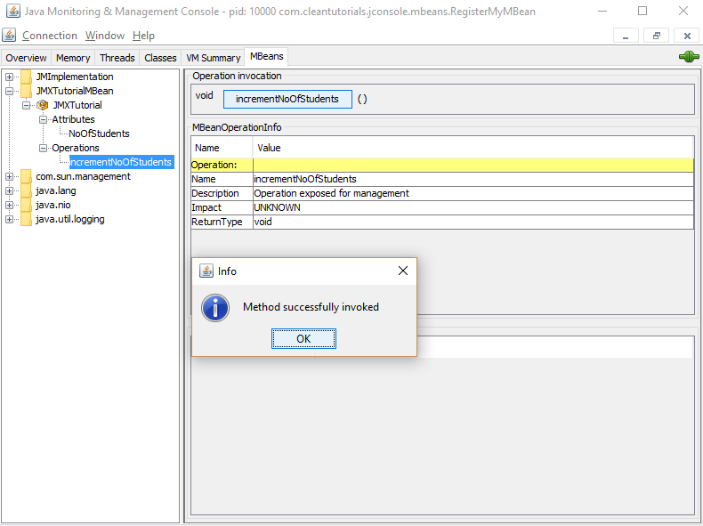

### JMX (Java Management Extension)

**J2SE**(Java Platform 2 Standard Edition) 에서 자바 앱의 모니터링과 관리가 쉽도록 Version 5.0 JMX를 지원합니다. Java 어플리케이션의 각 thread 상태 관리를 수행할 수 있게합니다.

<!-- more -->

JMX 구조에는 3가지 주요 컴포넌트가 존재합니다.

- JMX agent (JVM; Java Virtual Machine 위에서 동작하며 모니터링과 관리가 필요한 곳에 설치)
- Mbeans (JMX agent를 통해 모니터링 하는 자원을 말합니다.)
- Remote Management System (리모트 관리 애플리케이션으로 JMX Agent에 접속해 모니터링 할 수 있게 해주는 것)
  - Remote Management System 예시 프로그램
    - **JConsole**


### JMX Architecture

- MBeans (자원 그 자체)
- 일종의 JMX Agent 구성
  - MBean Server (자원을 모아서 넘겨줄 서버)
  - Connector and Protocol Adapter (요청이 들어오면 들어오는 것을 관리해 주는 역할)
- Management and Monitoring Application



> https://www.cleantutorials.com/jconsole/how-jmx-works-monitoring-your-java-application-remotely


### MBeans

MBeans는 각각의 다른 리소스의 모음으로 Java platform에서 제공하는 미리 정의한 리소스인 (MBeans)으로 JVM 모니터링에 활용한다.

- MBean에서 제공하는 attributes and operations 예시

  **Threading**

  ​	Attributes

  ​		ThreadAllocatedMemoryEnabled

  ​		ThreadAllocatedMemorySupported

  ​		AllThreadIds

  ​		...

  ​	Operations

  ​		getThreadCpuTime

  ​		getThreadUserTime

  ​		getThreadAllocatedBytes

**MBean 자료 구조체를 정의하고 코딩**

`JMXTutorialMBean.java`

```java
package com.test.jconsole.jmx;

public interface JMXTutorialMBean {
    
    public int getNoOfStudents();
    
    public void setNoOfStudents(int x);
    
    public void incrementNoOfStudents();
}
```

`JMXTutorial.java`

```java
package com.test.jconsole.jmx;

public class JMXTutorial implements JMXTutorialMBean {
    private int noOfStudents;
    
    public int getNoOfStudents() {
        return noOfStudents;
    }
    
    public void setNoOfStudents(int noOfStudents) {
        this.noOfStudents = noOfStudents;
    }
    
    public void incrementNoOfStudents() {
        noOfStudents++;
    }
}
```


### MBean Server

MBean server는 JMX agent 의 코어 컴포넌트 입니다. Remote management application은 MBean Server에 등록된 MBean만 모니터링하며 관리가 가능합니다.

`MBean 등록`

```java
package com.test.jconsole.jmx;

import java.lang.management.ManagementFactory;

import javax.management.InstanceAlreadyExistsException;
import javax.management.MBeanRegistrationException;
import javax.management.MBeanServer;
import javax.management.MalformedObjectNameException;
import javax.management.NotCompliantMBeanException;
import javax.management.ObjectName;

public class RegisterMyBean{
    public static void main(String[] args) throws MalformedObjectNameException, InstanceAlreadyExistsException, MBeanRegistrationException, NotCompliantMBeanException {
        
        <!-- MBeanserver 객체를 가져온다. -->
        MBeanServer server = ManagementFactory.getPlatformMBeanServer();
        
        <!-- JMXTutorial 이름의 오브젝트 이름 JMXTutorialMBean -->
        ObjectName name = new ObjectName("JMXTutorialMBean:type=JMXTutorial");
        JMXTutorial tutorial = new JMXTutorial();
        
        <!-- MBean을 서버에 등록 -->
        server.registerMBean(tutorial, name);
        try {
            Thread.sleep(360000);
        } catch (InterrupedException e){
            e.printStackTrace();
        }
    }
}
```


### Connector and Protocol Adapter

Connector, Protocol Adapter는 MBean Server와 Remote management application 사이 통신을 가능하게 합니다. 자바 플랫폼은**RMI**(Remote Method Invocation) Connector를 제공합니다. JConsole(Management application)은 RMI connector를 통해 MBean server와 통신합니다. 여러 JMX 포트를 통해 연결될 수 있습니다.

Adapter 와 connector의 차이점은 **"통신이 이뤄지는 방식"** 입니다. Adapter는 특정 프로토콜에 따라 다릅니다. ex) 예를들어 JMX agent를 사용하여 웹 브라우저 / 콘솔을 연결 하려면 HTTP protocol을 지원하는 Adapter가 필요합니다.  반면 Connector는 JMX 사양을 준부사며 최소한 RMI 구현이 있어야 합니다.


### Remote Management Application

Remote Management Application은 JMX Agent에 Connector를 사용해 연결합니다. 이 어플리케이션을 이용해 MBeans을 관리할 수 있습니다.

대표적인 관련 예시 툴

- JConsole
- VisualVM

위의 `JMXTutorial.java`  에서 정의한 get/set method을 이용




`JMXTutorial.java`  에서 정의한 incrementNoOfStudents  method을 이용




### 참조

> https://www.oracle.com/technical-resources/articles/javase/jmx.html